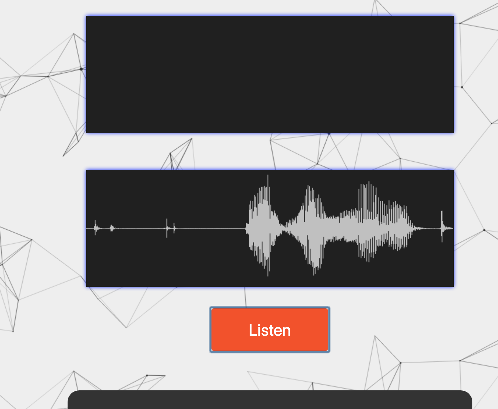

# DeepSpeech Demo



## About

This is a simple web-interface and Node server that uses [DeepSpeech](https://github.com/mozilla/DeepSpeech) to create a local Speech-to-Text service.

I mostly built it for myself, in order to play around with DeepSpeech, but it can be used
as a starting point for your own experiments.

## Prerequisites

The demo relies on [SoX](http://sox.sourceforge.net/) being available
on your system and in your PATH.

A quick seach for `how to install SoX on (windows|ubuntu|mac)` should do the trick
for you if you don't know how to install it, at least it did for me.

## Install

First, clone the repository:

```bash
git clone git@github.com:asciidisco/deepspeech-demo.git
```

Then change into the directory & perform an npm install:

```bash
npm install
````

As this downloads the pre-trained models from the DeepSpeech releases as a postinstall step,
which are roughly 1.4 GB, it might take a while.

After that, start the server using:

```bash
npm start
```

And navigate to [http://localhost:3000](http://localhost:3000)

## Usage

The user interface is quite reduced, after you´ve agreed that the page is allowed
to use your microphone, you just need to hit the "Listen" button and speak a few words
into your microphone. After you finished your sentence, you need to hit the "Listening..."
button once again, so that the recorded sound can be processed.
After a few seconds, you should see the text in the result box below the button.
